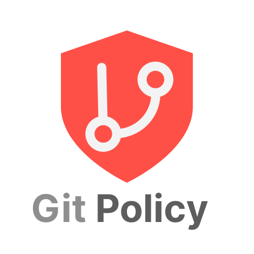
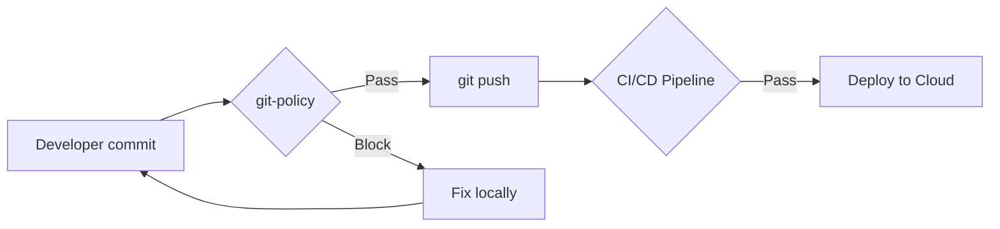
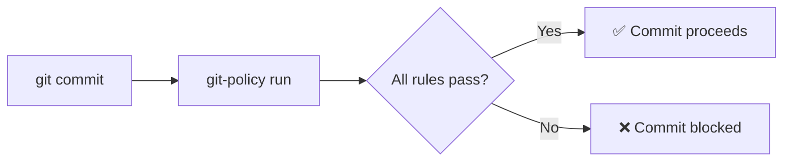

<div align="center">



**Global Git rule management.** Install once, protect every local repository.

[](https://go.dev)
[](LICENSE)
[]()
[](CONTRIBUTING.md)
[](https://github.com/marcuwynu23/git-policy/actions/workflows/test.yml)
[](https://codecov.io/gh/marcuwynu23/git-policy)

No per-repository setup. No repository-based Git hooks to configure. No CI dependency.
Just one global install and every repository on your machine is protected.

</div>

---

```bash
git policy install   # one-time setup
git add .env
git commit -m "test" # ← blocked automatically
```

## Why git-policy?

Every developer has accidentally committed something they shouldn't:

- A `.env` file with database credentials
- An AWS secret key hardcoded in a config file
- A 200MB binary that bloats the repository forever
- A commit directly to `main` or `production`
- A sloppy commit message like `"fixed stuff"`

Existing tools like **Husky**, **Lefthook**, and **pre-commit** solve this —
but only if you configure them **in every single repository**.

git-policy flips the model: **install once globally**, and rules apply
to every repository you work on. Zero setup per project. Zero CI configuration.

### How it's different

|                         | git-policy             | Husky              | Lefthook             | pre-commit                |
| ----------------------- | ---------------------- | ------------------ | -------------------- | ------------------------- |
| Install once globally   | Yes                    | No                 | No                   | No                        |
| Per-repository setup needed   | **None**               | npm install + init | config file per repository | `.pre-commit-config.yaml` |
| Built-in secret scanner | Yes                    | No                 | No                   | Plugin                    |
| Built-in branch protect | Yes                    | No                 | No                   | No                        |
| Built-in file blocking  | Yes                    | No                 | No                   | No                        |
| Built-in commit lint    | Yes                    | Plugin             | Script               | Plugin                    |
| Cross-platform          | Yes                    | Yes                | Yes                  | Yes                       |
| Written in              | **Go** (static binary) | JS                 | Ruby                 | Python                    |

---

## Use Cases

### Solo Developer

You work on 10+ projects. You don't want to set up hooks in each one.
Install git-policy once. Every `git commit` is checked automatically.
No configuration files scattered across your projects.

### Engineering Team

Your team has standards: conventional commits, no secrets in code,
no direct pushes to production. Share one YAML config file.
Every developer runs `git-policy install` once on their machine.
Enforcement happens locally, before code ever reaches CI.

### Open Source Maintainer

Contributors come and go. You can't enforce that everyone installs
a specific tool. With global git-policy, at least **you** are protected
from accidental secret leaks or bad commits, regardless of which
project you're working on.

### DevOps / CI/CD Teams

git-policy **shifts left** — it catches rule violations on the
developer's machine _before_ code ever reaches CI/CD, the cloud,
or a code review.



Without git-policy, secret leaks or bad commits are only caught
mid-pipeline — wasting CI minutes, clogging logs, and slowing
down the team. With git-policy, issues are blocked **instantly**
at the one place they're cheapest to fix: the developer's keyboard.

**What this means for DevOps:**

- **Fewer failed CI runs** — secrets, large files, and bad messages
  are filtered before `git push`
- **Less noise in CloudWatch / Datadog / alerts** — no accidental
  credentials making it to the repository
- **Faster feedback loop** — developer knows in < 100ms instead
  of waiting 5-15 minutes for a CI job
- **No CI dependency** — rules work offline, on a plane, in
  an airgapped environment

---

## How It Works



---

## Built-in Rules

| Rule                 | What it does                                                                                            |
| -------------------- | ------------------------------------------------------------------------------------------------------- |
| **BlockFiles**       | Prevents committing `.env`, `*.pem`, `*.key`, `*.p12`, `*.crt` (configurable)                           |
| **SecretScan**       | Detects AWS keys, GitHub tokens, OpenAI keys, Stripe keys, Slack tokens, JWTs, and more in staged files |
| **BranchProtection** | Blocks direct commits to `main`, `master`, `production` (configurable)                                  |
| **CommitMessage**    | Enforces conventional commits: `feat:`, `fix:`, `docs:`, `test:`, etc.                                  |
| **FileSize**         | Rejects files larger than the configured limit (default 10MB)                                           |
| **BinaryFile**       | Blocks `.exe`, `.dll`, `.so`, `.iso`, `.zip` from being committed                                       |

Each rule can be enabled/disabled individually via the CLI or config file.

---

## Quick Start

```bash
# 1. Install
git clone https://github.com/marcuwynu23/git-policy
cd git-policy
make dev

# 2. Verify
git policy doctor

# 3. See active rules
git policy rule list

# 4. It just works — try it
mkdir test-repository && cd test-repository
git init
echo "secret=abc" > .env
git add .env
git commit -m "test"    # ← blocked by BlockFiles rule
```

For detailed usage, see [GUIDE.md](GUIDE.md).

---

## Commands at a Glance

| Command               | What it does                            |
| --------------------- | --------------------------------------- |
| `install`             | Install global hooks (one-time)         |
| `uninstall`           | Remove hooks (keeps config)             |
| `uninstall --all`     | Remove hooks + config entirely          |
| `run`                 | Run rules against current repository          |
| `doctor`              | Check if git-policy is set up correctly |
| `validate`            | Check if config is valid                |
| `rule list`           | Show all rules and on/off status        |
| `rule enable <name>`  | Turn a rule on                          |
| `rule disable <name>` | Turn a rule off                         |

> `policy` may be used in place of `rule` (e.g. `git-policy policy list`) as an accepted alias.

---

## Example Workflow

```bash
# Developer clones a project — git-policy is already active
git clone https://github.com/team/project
cd project

# Accidentally stage a .env file
echo "DB_PASSWORD=secret" > .env
git add .env
git commit -m "add config"

# BLOCKED: BlockFiles - .env detected
# Fix: Remove .env from staging or add it to .gitignore

# Developer fixes
echo "DB_PASSWORD=secret" > .env.example
git add .env.example
git commit -m "feat: add env example"
# PASS: All policies passed
```

---

## Limitations

- **No per-repository overrides** — policies are global only. You can't have
  different rules for different projects yet.
- **No custom rules** — the plugin system is not implemented. You're
  limited to the 6 built-in rules.
- **No remote sync** — team policy distribution via Git repository or HTTP
  endpoint is planned but not available.
- **No pre-push rules** — the pre-push hook runs policies but there
  are no push-specific checks (e.g., blocking force push).
- **No GUI** — CLI only.
- **No Windows native hooks** — hooks run via Git Bash (shipped with
  Git for Windows). No PowerShell-based hooks.

These are all on the roadmap.

---

## Documentation

| Resource                               | What's in it                                                        |
| -------------------------------------- | ------------------------------------------------------------------- |
| **[GUIDE.md](GUIDE.md)**               | Full usage guide, configuration reference, testing, troubleshooting |
| **[CONTRIBUTING.md](CONTRIBUTING.md)** | Building, testing, adding rules, code standards                     |
| **[MAINTAINERS.md](MAINTAINERS.md)**   | Project maintainers                                                 |
| **[CONTRIBUTORS.md](CONTRIBUTORS.md)** | List of contributors                                                |

---

## Community

- [Code of Conduct](CODE_OF_CONDUCT.md) — expectations for contributors
- [Security Policy](SECURITY.md) — how to report vulnerabilities
- [Support Guide](.github/SUPPORT.md) — where to get help
- [Issue Template](.github/ISSUE_TEMPLATE/) — templates for reporting bugs or feature requests
- [Pull Request Template](.github/PULL_REQUEST_TEMPLATE.md) — PR guidelines

---

## License

Apache 2.0 — chosen for its patent protection and compatibility with
the open-source ecosystem. Contributions are accepted under the same
license.

Happy coding!
